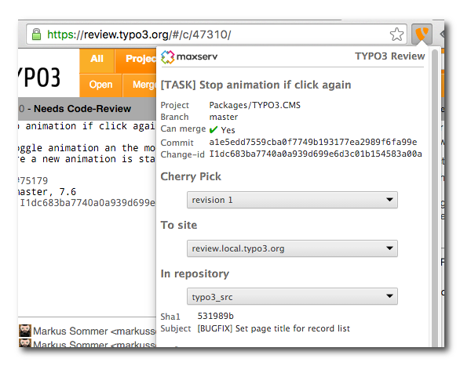
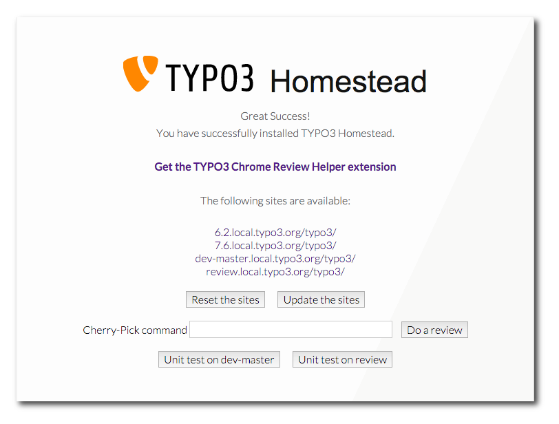
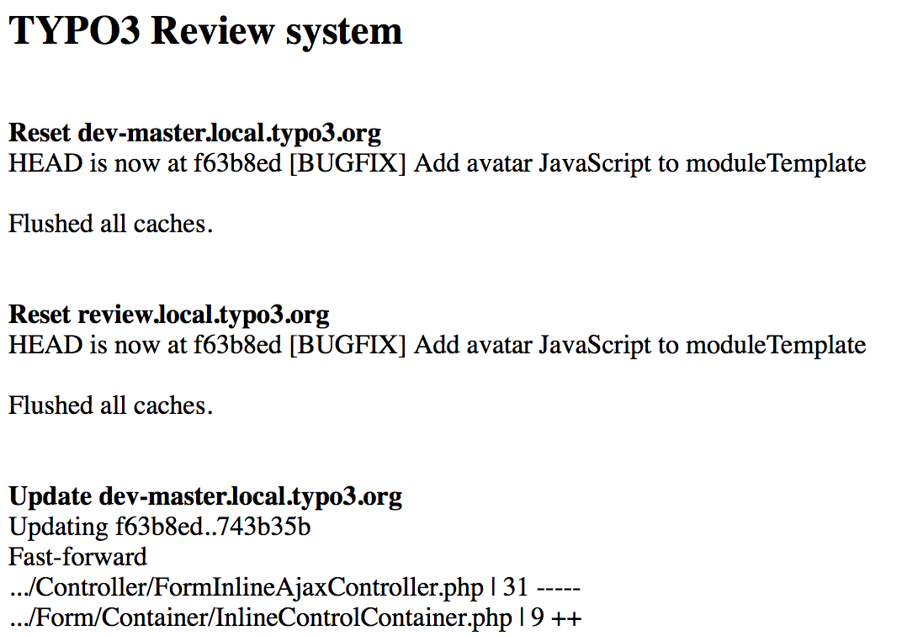
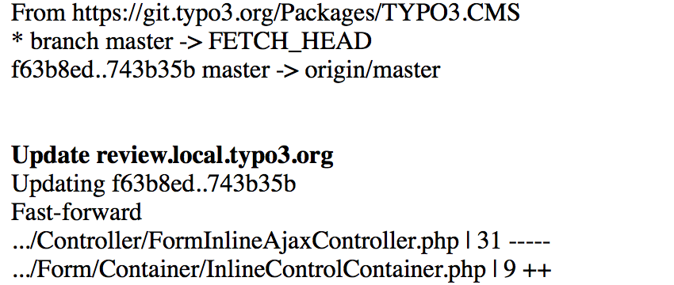
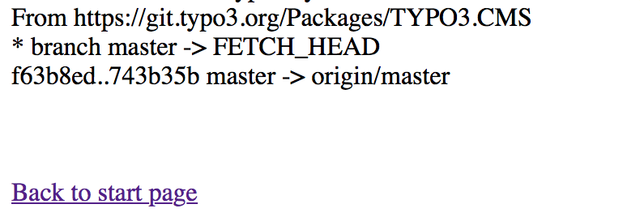
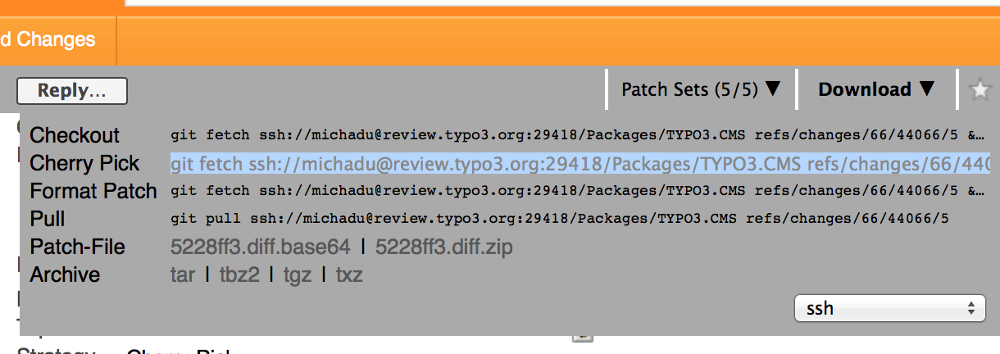
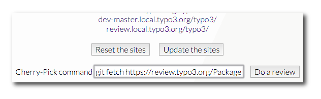
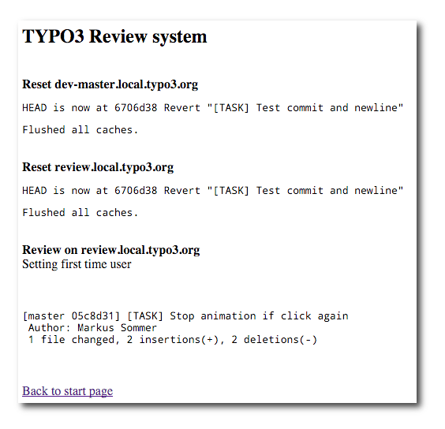

TYPO3 Homestead
===============

TYPO3 Homestead is your one-stop [TYPO3](http://typo3.org) and [Neos](http://neos.io) development environment. Just run `vagrant up` and a full Linux Ubuntu distribution will be downloaded with all the packages and configuration needed to start development right away.

This environment is intended as as a local environment. Security-wise it is in NO WAY fit for production.

Effortlessly test one site against multiple PHP versions and hhvm.

[](https://flattr.com/submit/auto?user_id=Tuurlijk&url=https://github.com/Tuurlijk/TYPO3.Homestead&title=TYPO3.Homestead&language=Ansible&tags=github&category=software)

Requirements
------------

* [Virtualbox](https://www.virtualbox.org/) - Version 5.* - or another virtualization product - Free!
* [Vagrant](http://www.vagrantup.com/) - Version 1.7.* is needed - Free!

Installation
------------

Installation is pretty straight forward. You're just a few steps away from 'great success'.

**without git**
* Download the latest [TYPO3.Homestead zip file](https://github.com/Tuurlijk/TYPO3.Homestead/archive/master.zip)
* Extract the zip file
* Open a command shell
* Go into the new directory
* Run `vagrant up`

**with git**
* Open a command shell
* Clone the repository: `git clone https://github.com/Tuurlijk/TYPO3.Homestead.git`
* Go into the new directory: `cd TYPO3.Homestead`
* Start the machine: `vagrant up`

When the machine has booted, you can visit [http://local.typo3.org](http://local.typo3.org). And also any of the pre-configured sites or any site you configured. The default sites are:

* [6.2.local.typo3.org/typo3/](http://6.2.local.typo3.org/typo3/)
* [7.6.local.typo3.org/typo3/](http://7.6.local.typo3.org/typo3/)
* [dev-master.local.typo3.org/typo3/](http://dev-master.local.typo3.org/typo3/)
* [review.local.typo3.org/typo3/](http://review.local.typo3.org/typo3/)
* [1.2.local.neos.io/neos/](http://1.2.local.neos.io/neos/)
* [2.0.local.neos.io/neos/](http://2.0.local.neos.io/neos/)
* [dev-master.local.neos.io/neos/](http://dev-master.local.neos.io/neos/)

All TYPO3 and Neos installation are fully set-up. You can login to the backend with: `admin`/`supersecret`.

The error log can be inspected using: `multitail /var/log/nginx/error.log`.

The database credentials can be found in `roles/mariadb/vars/main.yml`. The typo3 user has access to all databases. The install tool password is the TYPO3 default.

The amount of CPUs available on the host machine will also be available on the guest machine. 25% of the available host machine memory will be made available on the guest machine. The minimum amount of memory will be enforced to 1024 MB. You should not have to pass any extra parameters when starting the box.

The CNAME *.local.typo3.org resolves to the IP 192.168.144.120. This means you will have magic auto-resolving hostnames. So if you change the IP, you will need to take care of your hostname resolving yourself, either by hardcoding all the hostnames you wish to use or by some other means.

To reduce the box size, all git sources are now 'shallow' clones. You will find only a single branch and a history of the last 100 commits. You can fetch the full history by doing a `git fetch --unshallow`.

SSH Access
----------

You can find a terminal op: [http://shell.local.typo3.org](http://shell.local.typo3.org)

If you set up a box without a file share, you will want to access the box using ssh. To add your public ssh key to the authorized_keys file of the vagrant user, you can execute the following command:

```bash
 cat ~/.ssh/id_rsa.pub | ssh vagrant@local.typo3.org 'cat >> .ssh/authorized_keys'
```

Now you will be able to get into the box as user vagrant without supplying a password.

Multiple PHP versions
---------------------

If you prefix your site name with `hhvm`, `php55`, `php56` or `php70`; your request will be served by that backend:

* http://php55.1.2.local.neos.io
* http://php56.2.0.local.neos.io
* http://php70.dev-master.local.neos.io
* http://hhvm.6.2.local.typo3.org

You can see what backend is used by inspecting the `X-Powered-By` response header.

On the commandline these php versions are available as:

* php55
* php56
* php70

The box currently has PHP 7.0.3 as base PHP version.

Reviews
-------

The TYPO3 Review box makes reviewing patches for TYPO3 as easy as possible.
You do not have to set up anything else than this review box to get started reviewing for the TYPO3 development.

This review box includes 3 TYPO3 web sites.
First is the last released version (7.5 in time of writing this), second is the development version of the master for reference and the third is the master for doing the reviews.

All sites have an installed introduction package to have a running website out of the box. Also the Styleguide and IconAPI extensions are installed.

Using the Chrome Helper
.......................

If you don't want to manually copy and paste the cherry-pick commands you can use the [TYPO3 Review Chrome extension](https://chrome.google.com/webstore/detail/typo3-review/omloegomfdeniikpijekbmggdgmkmkck). You're just a couple of clicks away from reviewing your first change.

Now you can view the „old“ version without the patch at [dev-master.local.typo3.org](http://dev-master.local.typo3.org) and the „new“ version with the patch at [review.local.typo3.org](http://review.local.typo3.org). It is easy to switch between the two browser tabs (or windows) to see what has been changed with the patch.



Using the review.php script
...........................

Open your browser and go to [local.typo3.org](http://local.typo3.org)

You can see a list of links to the backends of the installed sites and some buttons for resetting, updating and reviewing.

Before you start, the first action is to update the sites. Pressing the „Update“ button gets the latest commits from the repository and flushes the cache to get a clean system to work with. You should update the sites on a regular base, best is every time before starting to review something. Always both sites, the dev-master and review are updated to have them in identical state.

skip some lines here


skip some lines here



Now you have to search at [Gerrit](https://review.typo3.org) or even better at [Forger](https://forger.typo3.org) for a review you want to test. On the web page of the selected review item there is a dropdown on the upper right corner called „download“. Drop the list down, click on the line beginning with „Cherry pick“ and copy the line to the clipboard.

Then go to the web site local.typo3.org. Put the clipboard content into the input field „Cherry pick“ and press the „Do a review“ button.

The patch is then applied to review.local.typo3.org. 

Now you can view the „old“ version without the patch at [dev-master.local.typo3.org](http://dev-master.local.typo3.org) and the „new“ version with the patch at [review.local.typo3.org](http://review.local.typo3.org). It is easy to switch between the two browser tabs (or windows) to see what has been changed with the patch.

Profiling
---------

XHProf is a Hierarchical Profiler for PHP. Facebook developed it for in-house use and made it open-source in 2009. It is a powerful tool if you need to know exactly what your PHP code is doing. When you prefix any TYPO3 site name with 'xhprof'; `[http://xhprof.7.6.local.typo3.org/](http://xhprof.7.6.local.typo3.org/)` (and set the magic cookie _profile — use the [XHProf Helper extension for Chrome](https://chrome.google.com/webstore/detail/xhprof-helper/adnlhmmjijeflmbmlpmhilkicpnodphi)), profiles will be created.

You can view the profiles on the XHGui site [http://xhprof.local.typo3.org/](http://xhprof.local.typo3.org/). Here you can see beautiful internals of your code doing it’s weird dance. Now it’s time to zoom in on some of the bottlenecks and start fixing the code.

Synced folders
--------------
Edit the vagrant.yml file in `Configuration/`. Setup a shared directory to hold your TYPO3 sources and sites in the `Configuration/vagrant.yml` file:

```yaml
synced_folders:
  - name: Development
    src: ~/Projects/TYPO3/Review
    target: /var/www
```

Make sure the `src` directory exists on your host machine!

If you use shared folders, the contents of the shared `src` folder will replace the the content of the `target` folder on the Vagrant box. You will need to take care of setting up the MySQL databases inside of the Vagrant box. Or you can send me a pull request with some fancy lightweight provisioning code ;-).

Make sure the vagrant box can make a nfs connection to the host. Check your firewall settings if the host cannot connect to the shared folder. Enable access to nfsd and rpc.*.

If you don't do this, you may want to add your public ssh key to the authorized_keys file of the vagrant user. Read the section SSH Access.

MailCatcher
-----------

[MailCatcher](http://mailcatcher.me/) runs a super simple SMTP server which catches any message sent to it to display in a web interface. This makes it easy to test forms without actually sending mail to the 'real' mail address. Set your favourite app to deliver to smtp://127.0.0.1:1025 instead of your default SMTP server, then check out [http://mail.local.typo3.org](http://mail.local.typo3.org) to see the mail that's arrived so far.

Mailcatcher has been set up for TYPO3 CMS. For Neos, you may be interested in the [https://github.com/langeland/Langeland.SwiftBox](Langeland.SwiftBox) package. It is a package that can override the swiftmailer setting to send to that instead and you can browse all the emails with the included flow application.

Features
--------

TYPO3 Homestead comes with the following stack:

* TYPO3 CMS
* NEOS CMS
* composer
* elasticsearch
* hhvm
* multiple PHP versions [Current versions](https://github.com/Tuurlijk/TYPO3.Packer/blob/master/ansible/configuration/Development/php.yml#L56)
* mailcatcher
* mariadb
* memcached
* nginx + http2
* nodejs
* php-apcu
* php-fpm
* postfix nullmailer (outgoing only)
* rabbitMQ
* redis
* self signed ssl certificates
* shellinabox [http://shell.local.typo3.org](http://shell.local.typo3.org)
* xdebug
* xhprof / blackfire
* zsh

The flexible configuration allows you to create any combination of TYPO3 source and PHP backend with or without SSL.

Can't connect after the vagrant up?
-----------------------------------

This box needs internet connectivity to resolve the local.neos.io domain name to the IP of the box. If you are not connected to the Internet you will need to add the following entries to your hosts file:

* 192.168.144.120 1.2.local.neos.io
* 192.168.144.120 2.0.local.neos.io
* 192.168.144.120 dev-master.local.neos.io
* 192.168.144.120 6.2.local.typo3.org
* 192.168.144.120 7.6.local.typo3.org
* 192.168.144.120 dev-master.local.typo3.org
* 192.168.144.120 review.local.typo3.org

Contributing
------------

Built with Packer: [patches are welcome ;-)](https://github.com/Tuurlijk/TYPO3.Packer).

In lieu of a formal styleguide, take care to maintain the existing coding style. Add unit tests and examples for any new or changed functionality.

1. Fork it
2. Create your feature branch (`git checkout -b my-new-feature`)
3. Commit your changes (`git commit -am 'Add some feature'`)
4. Push to the branch (`git push origin my-new-feature`)
5. Create new Pull Request

TODO
----

* Nginx configuration snippets?
  https://github.com/h5bp/server-configs-nginx/blob/master/h5bp/
* Enable configuration through yml file like http://laravel.com/docs/5.0/homestead
* Add available backends as examples to index sites (http://local.neos.io and http://local.typo3.org)

Known Problems
--------------

* The sources that are fetched from github may be hard to reach when github is under a DDOS
* If you get the error `The box 'ubuntu/trusty64' could not be found`, then you may have a vagrant version lower than 1.5. The stock Ubuntu vagrant version is 1.4 at the time of writing. You can get the latest vagrant version from [the vagrant site](https://www.vagrantup.com/downloads). Some details can be found on [vaprobash issue #322](https://github.com/fideloper/Vaprobash/issues/322).
* On Windows machines you may need to enable VT-X in the bios of your machine. vt-x is disabled in the BIOS, you can disable this in the image settings under system tab processor, PAE/NX disable or you can enable this setting in your BIOS. Check: [http://www.sysprobs.com/disable-enable-virtualization-technology-bios](http://www.sysprobs.com/disable-enable-virtualization-technology-bios) and check your windows version ( minimal a Pro-edition) or [Enable without BIOS](http://stackoverflow.com/questions/31581854/enabling-intel-virtualization-vt-x-without-option-in-bios).
* Vagrant may complain about a 'space' character in your path. Ruby can't handle this. You will need to move the Vagrant box to a path without spaces and try again.
* [Windows host-only adapter creation fails due to slow background processing](https://www.virtualbox.org/ticket/14040) - Use [the fix](https://www.virtualbox.org/attachment/ticket/14040/VBox-Win10-fix-14040.exe)

License
-------

[GNU General Public License version 3](https://www.gnu.org/licenses/gpl-3.0.html)

References
----------

- [konomae/ansible-laravel-settler](https://github.com/konomae/ansible-laravel-settler)
- [laravel/homestead](https://github.com/laravel/homestead)
- [laravel/settler](https://github.com/laravel/settler)
- [phpbrew](https://github.com/phpbrew/phpbrew)
